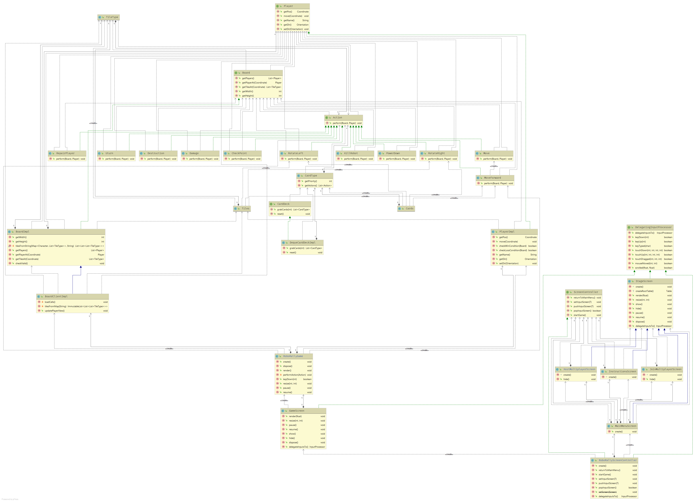

# Obligatorisk oppgave 1: Prosjekt RoboRally

Project board at 05.03.21 11:45

## Deloppgave 1: Prosjekt og prosjektstruktur

### Roller:
Rollene fungerer bra så langt. Har ikke sett så mye i praksis enda annet enn 
at teamlead har hatt en sentral rolle. Kundekontakt har vært i kontakt med 
kunde (TA) og hentet informasjon, resten har hatt aktive roller som developers. 
Foreløpig trenger vi ikke å gjøre endringer på roller (kanskje større oppgaver 
på hver med tanke på frafall fra en på teamet). Legger til roller fortløpende 
om det trengs.

**Teamlead:** 
Tar en leder rolle og organiserer teamet og sier i fra når det trengs (overordnet kontroll)

**Kundekontakt:** 
God kommunikasjon med kunden så produktet blir 100% sånn som ønsket

**Developers:** Developers som blir satt på ulike oppgaver når det trengs

### Erfaringer:
* Merge conflicts kan være vanskelig
* Teamet overvurderer hvor mye vi får gjort innen en viss tidsramme
* Når kommunikasjonen er god lever vi bedre produkt
* Lurt å lage ny branch når vi begynner på en ny oppgave er lurt

### Gruppedynamikken:
Grei nå. God og hyppig kommunikasjon styrker dynamikken så dette er noe 
vi kan bli bedre på. Dersom man sitter fast kan teamet bli bedre til å spørre 
om hjelp, og se om andre på teamet har en god løsning. Viktig å oppdatere andre 
på hva man jobber med så vi ikke med uhell jobber med det samme og kaster bort tid.

### Kommunikasjon:
Har forbedret seg fra første innlevering, vi har mer aktivitet i discorden, 
samt har satt opp ekstra måte på mandager. Har blitt flinkere når det kommer 
til kommunikasjons men kan alltids bli bedre.

### Hvordan er commitbalansen:
Commitene i starten var veldig ubalansert. Teamlead hadde en god del flere en 
resten av teamet. Flere på teamet har blitt flinkere på å commite, 
men her må vi bli flinkere. Det er veldig skjevt fordelt enda, og vi må bli 
flinkere på at hele teamet får inn commits og åpner PR, så fordelingen blir jevn.

En grei og aksepterbar forklaring på at f.eks teamlead har mye flere commits enn 
resten er at teamlead har mye mer erfaring både med prosjektarbeid og kode, 
og har fått på plass og ordnet en del ting resten av teamet ikke har hatt 
kunnskap om eller fått til. Forskjellig kompetansenivå på teamet er et fakta, 
og dette er nok en av hovedgrunnene til at commitene er så ubalanserte på teamet.

### Forbederedningspunkter fra retroperspektivet:
Teamet må ha mer balanserte commits, og prøve at alle på teamet får inn 1-2 PR 
hver i løpet av en uke. Kommunikasjon over discord skal bli bedre.

## Deloppgave 2: Krav

### Brukerhistorier og akseptansekrav til arbeidsoppgaver

#### Brukerhistorier - CardDeck for å holde kort:

1. Som spiller ønsker jeg at spillet har en sentral kortstokk som jeg kan få 
   kortene mine fra, slik at jeg kan programmere rutene mine.

2. Som spiller ønsker jeg å kunne se alle kortene jeg har fått, slik at jeg 
   kan planlegge mine neste flytt.

3.  Som spiller ønsker jeg at kortene skal bli tilfeldig delt ut
    1. Dette er for å skape en lik sannsynlighet for at hver spiller får utdelt 
       de ulike kortene.
    2. Dette hjelper med å unngå at en spiller får en ufortjent fordel ved å 
       kun få spesifikke kort.

##### Akseptansekrav:
1. Given a CardDeck
   1. Grabbing a given amount of cards should:
      1. Return a list of that size 
      2. Return random cards each time the list is shuffled

   2. Grabbing more cards then there are remaining cards should  throw an IllegalStateException
   3. Resetting it should return all dealt cards to it, and shuffle it

#### Brukerhistorier - Utdelte kort:
1. Som spiller ønsker jeg å kunne velge rekkefølge på kortene mine for å lage system
2. Som spiller ønsker jeg å flytte meg ut i fra kortene, for å flytte meg dit jeg ønsker.

##### Akseptansekrav:
1. Gitt at jeg er en spiller på brettet
   Gitt 5 utleverte tilfeldige kort 
   1. Vil jeg kunne se alle disse 
   2. Vil jeg vite funksjonalitet til kortene 
   3. Vil jeg kunne endre rekkefølgen på disse 
   4. Vil jeg kunne utføre flytt og actions på brettet ut i fra disse

#### Hvordan Programming Cards Robo-rally funker:

There are 84 programming cards in Robo-Rally, and these cards determine how 
the players bot will move on the board. Each player will receive 9 programming 
cards each round (“Will receive on card less for each damage the player has taken, 
example: A player who have taken 2 damage, will only receive 7 cards”) The player 
will choose 5 of the delt cards and place them in a sequence from 1 to 5. 
The placed cards will in this sequence determine the movement on the board. 
Each player will move according to their first card. The player with the 
highest *priority* count on their card will move first. 
Out of the 84 cards there is a total of:

18 Move 1 Cards “Move one tile in the direction you are facing.”
12 Move 2 Cards “Move two tiles in the direction you are facing.”
6 Move 3 Cards “Move three tiles in the direction you are facing.”
6 Back Up Cards “Move one tile backwards in the opposite way you are facing.”
18 Rotate right cards “Rotate 90 degrees to the right, clockwise.”
18 Rotate left cards “Rotate 90 degrees to the left, counterclockwise.”
6 U-turn cards “Rotate 180 degrees and face in the opposite direction.”

#### Brukerhistorier - Multiplayer
Ikke implementert i denne innleveringen.

1. Som spiller ønsker jeg å ha med andre spillere, slik at spillet blir mer 
   dynamisk, og det skjer mer endringer på brettet

##### Akseptansekrav:
1. Gitt at jeg har startet spillet 
   1. Ønsker jeg å kunne bli med i et multiplayer spill noen andre hoster
   2. Ønsker jeg å kunne hoste et multiplayer spill

2. Gitt at jeg er med i et multiplayer spill
   1. Ønsker jeg å se flere spillere på brettet enn meg, og deres posisjon
   2. Ønsker jeg at hver spiller kan utføre handlinger
   3. Ønsker jeg å se handlinger utført av andre
   4. Ønsker jeg å kunne påvirke andre spillere

#### Lokal multiplayer
Ingen brukerhistorier ettersom at dette bare et implementasjonssteg til sann multiplayer.

Spillerbrikker kontrollert fra samme datamaskin. Skift mellom spillerbrikkene 
med number tastene. Trenger ikke å tenke på ting som at de ikke kan være i 
samme rute.

1) Oppgaver til multiplayer

Multiplayer må kunne kontrollere spille brikkene fra samme datamaskin
Multiplayer må kunne implementere player klassene slik at hver player får
brukt metodene og egenskapene som player har .
Multiplayer må kunne skifte mellom spillerbrikkene eller robottene med number
tastene

2) Kontrollere spillerbrikkene fra samme datamaskin

Vi trenger ikke bruke network eller kode slik at spillet skal gå online
men bruker taster slik at vi kan kontrollere spillebrikkene fra samme maskin

gitt at en
x id peker på en robot og at en y id peker på en annen robot

3) Multiplayer må kunne skifte brikker ved hjelp av nummer

vi trenger kode som gjør at vi kan gi en robot en id slik at vi lett kan bytte
players med hjelp av nummer

#### Brukerhistorier - Main menu skjerm

1. Som spiller, når jeg starter spillet, ønsker jeg å navigere mellom flere 
   spill moduser, slik at jeg kan velge den spill modusen som passer meg best.
2. Som spiller, når jeg starter spillet, ønsker jeg å ha et valg om å se 
   hvordan spillet spilles, slik at målet og spillprossesen er klart.
3. Som spiller ønsker jeg at menyen er brukervennlig, slik at jeg ikke 
   roter meg vekk.

##### Akseptansekrav:
1. Gitt at menyen vises
   1. Bør jeg kunne flytte meg
      1. Til nye skjermer
      2. Tilbake til den skjermen jeg kom ifra
   2. Bør der være klart for spilleren hvordan å starte et spill med spillmodusen de ønsker 
2. Gitt at spillet er igang
   1. Bør det alltid være en måte å komme tilbake til hovedmenyen
   2. Dersom spillet er slutt, skal brukeren sendes tilbake til menyen (ikke implementert)

### Hvordan har vi valgt og prioritere oppgavene?

Vi har valgt å fokusere på hver vår del av prosjektet, som for eksempel at 
Kathryn driver med Main Frame, Noora driver med Local multiplayer, 
mens Kasper og Espen har jobbet sammen for å få ferdig actions og players.

Vi har valgt å se bort i fra Multiplayer på denne innlevering men vil videre 
utvikle denne til senere. Priotering har vært å få inn rett movement for 
en player, og å få kortimplementasjon til å fungerer som vi ønsker. 
Nå vi har fått dette opp på et godt nivå skal vi gå videre på større og 
andre arbeidsoppgaver.

### Justeringer på MVP:

MVP kravene vi har dekket:
1. Vise et spillebrett
2. Vise brikke på spillebrett
3. Flytte brikke (vha taster e.l. for testing)
4. Robot besøker flagg
5. Robot vinner ved å besøke flagg
6. Dele ut kort
7. Velge 5 kort
8. Bevege robot ut fra valgte kort

MVP krav vi ikke har dekket:
Spille fra flere maskiner (vise brikker for alle spillere, flytte brikker for alle spillere)

Vi har valgt å ikke ta med dette enda da det rett og slett er for mye som må 
implementeres og vi har ikke fått det til enda. Punktet er enda ikke fjernet 
fra MVP og vi kommer til å implementere det.

## Deloppgave 3: Kode

Klassediagram:

Akseptansekrav til brukergrensesnittet:
1. Gitt at menyen vises
    1. Bør jeg kunne flytte meg
        1. Til nye skjermer
        2. Tilbake til den skjermen jeg kom ifra
    2. Bør der være klart for spilleren hvordan å starte et spill med spillmodusen de ønsker
        1. Gitt at spillet er igang
        2. Bør det alltid være en måte å komme tilbake til hovedmenyen
        3. Dersom spillet er slutt, skal brukeren sendes tilbake til menyen

2. Gitt at jeg er en spiller og nettopp har startet spillet skal jeg:
   1. Lett kunne få opp et spillbrett på skjermen med en bestemt størrelse
   2. Kunne se og skjønne hvordan spillbrettet er lagt opp, og at det er logisk satt sammen (ut i fra reglene på
        spillet)

3. Gitt at jeg er en spiller på et aktivt spill skal jeg:
   1. Kunne se forskjell på alle tiles og objekt på spillet
   2. Bli informert om hva de ulike elementene er og gjør
   3. Få opp et brett med klare skiller mellom grafikken, og se et brett bestående av element med grafikk som henger
     sammen med funksjonaliteten til elementet.

4. Gitt at jeg er en spiller og har et aktivt spill vil jeg:
   1. Se forandring på objekt på brettet dersom et flag blir besøkt
   2. Bli oppmerksom på dette gjennom nye element på brettet, og element som spesifikk symboliserer seier
   3. Få opp en melding på skjermen, eller i terminal som forklarer meg hva som skjer
