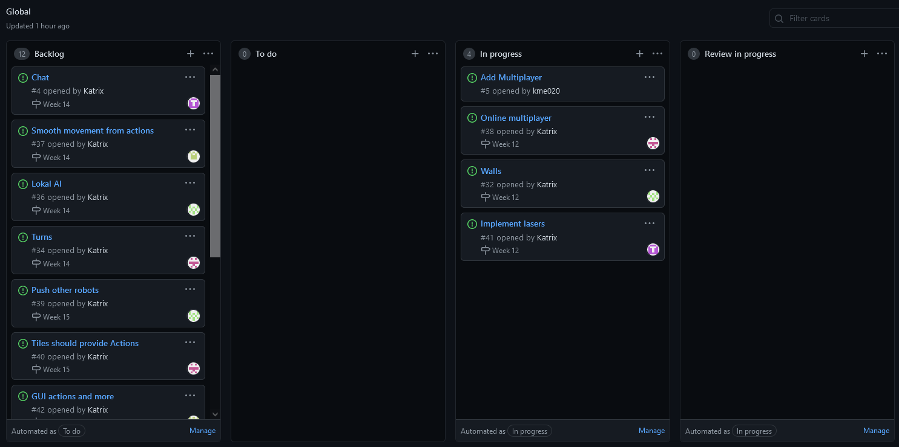
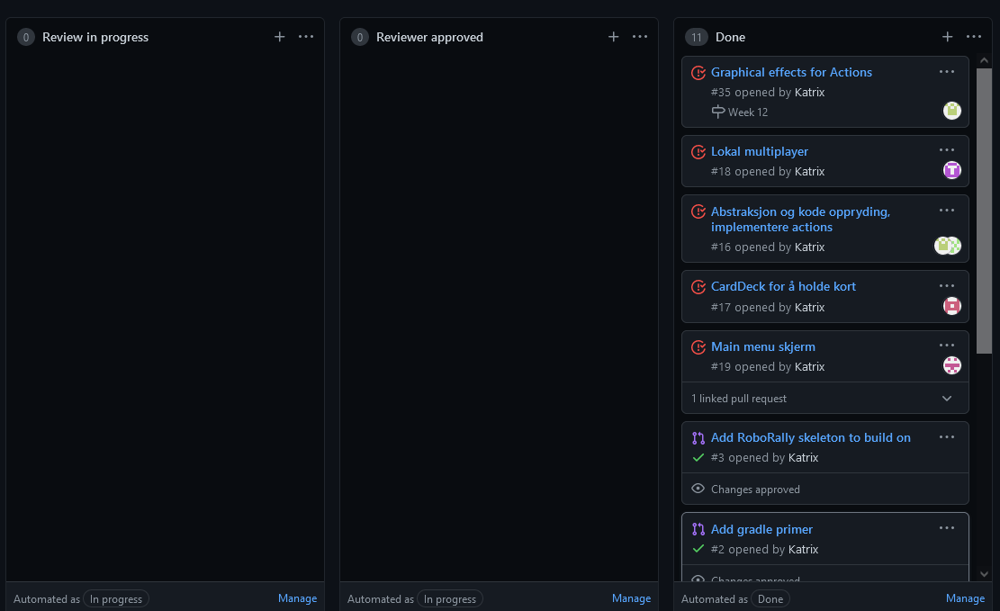
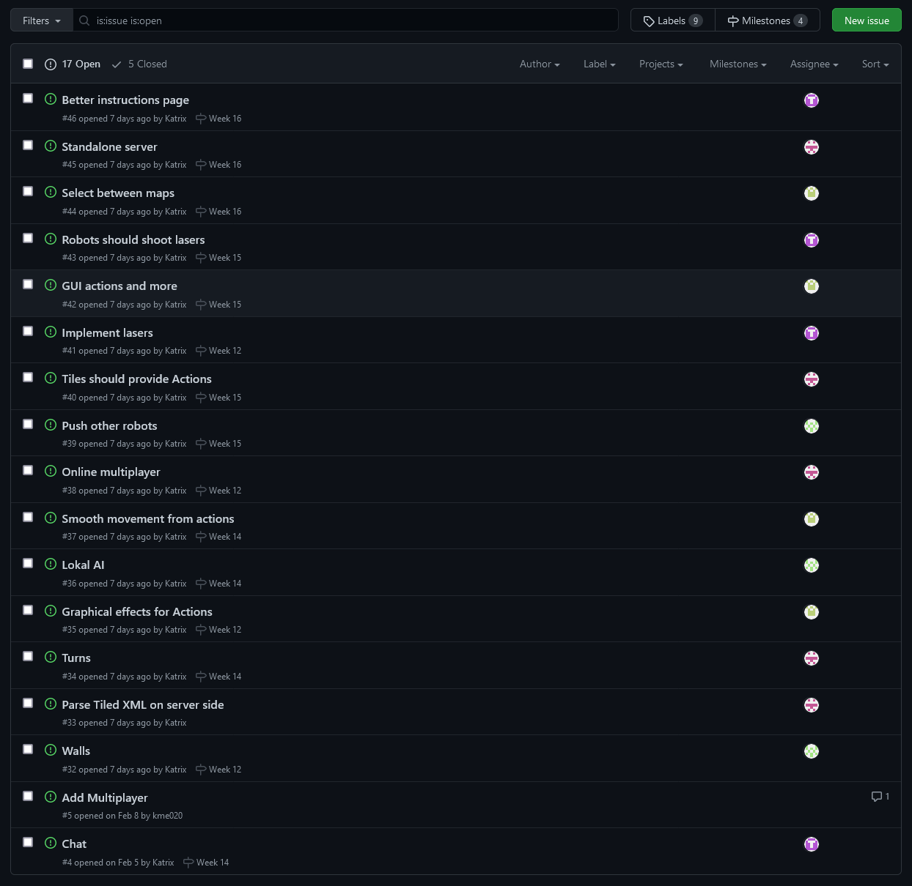
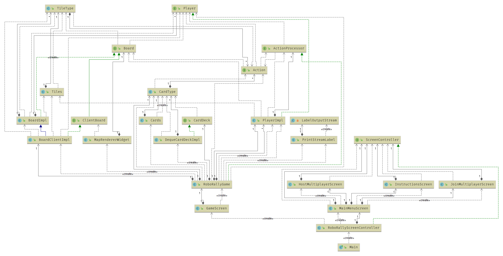
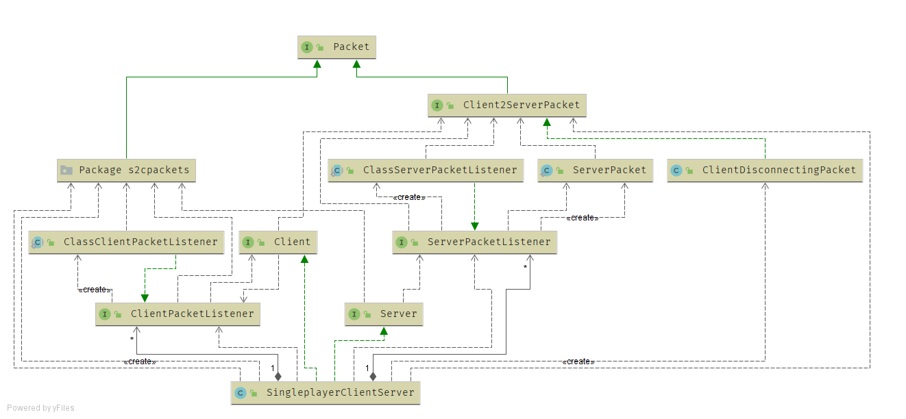

# Obligatorisk oppgave 3: Prosjekt RoboRally

Project board at 26.03.21 11:45

## Deloppgave 1: Prosjekt og prosjektstruktur

### Roller:

Som sist så fungerer rollene på samme måte, og vi har ikke gjort noen endringer her. Teamlead og kundekontakt er
uforandret, og hele teamet stiller som developers, og fyller inn der det trengs. Sånn som det ser ut nå er det ikke
nødvendig å gjøre endringer her.

#### Erfaringer og endringer:

Det er viktig å passe på at merge conflicts of alle checks passer når man åpner en pull request Ferdige arbeidsoppgaver
og tempo har vært veldig ubalansert, noen på teamet blir fort ferdig mens andre har brukt lengre tid. Dette fører til at
det blir mye dødtid der teamet venter på at noe skal bli kodet/gjort ferdig av noen andre. Endringer vi har gjort her:
ny prosjektmetodikk, vi har laget fremdriftsplan for teamet, med ulike tasks som skal bli gjort hver uke, og en task har
blitt assignet til en developer på teamet. Dette putter press på å få gjort ferdig oppgaver i tide, og legge inn mer
effort for å få det gjort. Dette synes teamet er en god løsning, og kan føre til bedre resultat og mer effektiv jobbing.
Når kommunikasjonen er god lever vi bedre produkt Lurt å lage ny branch for hver task

#### Gruppedynamikken:

God sånn som sist. Dersom noen sitter fast hjelper resten av teamet, dersom noen trenger en “push” får de dette. Ros og
konstruktiv kritikk er på plass for å sørge for at god kode og gode resultat blir gitt. Vi får ikke møtt alle fysisk på
grunn av restriksjoner og at folk ikke er i byen, så grunnlaget for dynamikken blir for det meste lagt digitalt.

### Kommunikasjon:

Går framover, vi har blitt enige at dersom man sitter fast på noe, enten på grunn av tekniske problem eller annet, skal
vi kontakte teamet umiddelbart, så alle vet hva som foregår, hvor vi ligger ann og hva som må bli prioritert. Dette har
ført til bedre kommunikasjon over Discord. Vi tar og i bruk møtene vi har satt opp på mandagene til diskutering og
kodehjelp.

#### Forbederedningspunkter fra retroperspektivet:

Teamet ble enige om å ha mer balansert commits. Dette har vi klart bra, og nå har fordelingen blitt mye bedre enn den
var sammenlignet med oblig 1. Vi ville prøve å få inn en fast PR hver i uken, dette ble det litt problemer med, og vi
har endret litt på dette. Som nevnt ovenfor har vi nå en fremdriftsplan vi skal følge, for å få en oversikt over hva
alle gjør og skal gjøre. Vi på teamet er fornøyd med denne så langt. Mesteparten av planlegging skjer nå på
fredagsmøtene, da kan man prøve seg litt fram i helgen og få litt erfaringer, hva er vanskelig, hva som må endres. På
mandagsmøtet kan vi diskutere disse og kjøre litt parprogammering om nødvendig. Kontinuerlig kommunikasjon på discord
har blitt bedre.

#### Forbedringspunkt vi ønsker å følge opp under neste sprint:

Mer effektiv jobbing, og flere tasks gjort (gjøre opp litt erfaringer med fremdriftsplanen og om denne fungerer bra
Dersom en på teamet sitter fast med en task, bør man bli flinkere til å rapportere dette inn med en gang, sånn at teamet
vet hvordan vi ligger ann.

#### Oppgaver fremover:

Som nevnt ovenfor har vi nå laget fremdriftsplan. Her er det ulike tasks som må bli gjort hver uke, dersom noen sitter
fast bistår resten av teamet og vi sammarbeider, om oppgaven er for vanskelig for noen på teamet kan vi bytte.
Fremdriftsplanen er en foreløpig draft for å ha litt kontroll over hva som må bli gjort, og for å ha litt press på
teamet.

## Deloppgave 2: Krav

Siden den forrige innleveringen har vi jobbet med GUI for å vise og velge kort, vegger, laser og få multiplayer til å
virke over nettverk. Vi er ikke helt ferdig

### Brukerhistorier og akseptansekrav til arbeidsoppgaver

#### Brukerhistorier - Multiplayer

Ikke implementert i denne innleveringen.

1. Som spiller ønsker jeg å ha med andre spillere, slik at spillet blir mer dynamisk, og det skjer mer endringer på
   brettet

##### Akseptansekrav:

1. Gitt at jeg har startet spillet
    1. Ønsker jeg å kunne bli med i et multiplayer spill noen andre hoster
    2. Ønsker jeg å kunne hoste et multiplayer spill

2. Gitt at jeg er med i et multiplayer spill
    1. Ønsker jeg å se flere spillere på brettet enn meg, og deres posisjon
    2. Ønsker jeg at hver spiller kan utføre handlinger
    3. Ønsker jeg å se handlinger utført av andre
    4. Ønsker jeg å kunne påvirke andre spillere

#### Lokal multiplayer

Ingen brukerhistorier ettersom at dette bare et implementasjonssteg til sann multiplayer.

Spillerbrikker kontrollert fra samme datamaskin. Skift mellom spillerbrikkene med number tastene. Trenger ikke å tenke
på ting som at de ikke kan være i samme rute.

1) Oppgaver til multiplayer

Multiplayer må kunne kontrollere spille brikkene fra samme datamaskin Multiplayer må kunne implementere player klassene
slik at hver player får brukt metodene og egenskapene som player har . Multiplayer må kunne skifte mellom
spillerbrikkene eller robottene med number tastene

2) Kontrollere spillerbrikkene fra samme datamaskin

Vi trenger ikke bruke network eller kode slik at spillet skal gå online men bruker taster slik at vi kan kontrollere
spillebrikkene fra samme maskin

gitt at en x id peker på en robot og at en y id peker på en annen robot

3) Multiplayer må kunne skifte brikker ved hjelp av nummer

vi trenger kode som gjør at vi kan gi en robot en id slik at vi lett kan bytte players med hjelp av nummer

MVP kravene vi har dekket:

1. Vise et spillebrett
2. Vise brikke på spillebrett
3. Flytte brikke (vha taster e.l. for testing)
4. Robot besøker flagg
5. Robot vinner ved å besøke flagg
6. Dele ut kort
7. Velge 5 kort
8. Bevege robot ut fra valgte kort

MVP krav vi ikke har dekket:
Spille fra flere maskiner.

#### Brukerhistorie Lasere

Ønsker at lasere skal vises på brettet og at det skal ha en funksjon som gir damage. Det skal plasseres flere lasere på
seller i spiller slik at når spilleren kjører over disse så blir de damaged.

Akseptansekrav:

Trenger funksjon til å sammenligne posisjonen til laseren med spiller slik at vi kan gi damage til spilleren som står i
en slik posisjon. Vi må gå gjennom brettet og finne ut hvor laserene befinner seg.

#### Brukerhistorie GUI for å vise og velge kort

1. Som spiller ønsker jeg å
    1. kunne se kortene mine på en oversiktlig måte slik at det blir lettere å bestemme hvilke kort jeg skal velge.
2. Jeg ønsker at kortene skal ha alle funksjonene som en carddeck trenger i spiller:

Som spiller ønsker jeg at spillet har en sentral kortstokk som jeg kan få kortene mine fra, slik at jeg kan programmere
rutene mine. Som bruker ønsker jeg å kunne se alle kortene i kortstokken før spillet begynner, slik at jeg kan planlegge
bedre når spillet begynner Akseptansekrav:
Given a CardDeck Grabbing a given amount of cards should:
Return a list of that size Return random cards each time the list is shuffled Grabbing more cards then there are
remaining cards should throw an IllegalStateException Resetting it should return all dealt cards to it, and shuffle it.

6. Gitt at jeg har fått tildelt kort ønsker jeg å kunne velge hvilke kort jeg vil bruke for å programmere roboten slik
   at jeg kan flytte meg rundt på brettet.

#### Brukerhistorie Walls

1. Som vegg ønsker jeg å
1. hindre roboter fra gå gjennom meg.
2. At spilleren skal se meg slik at den ser hvor det er mulig å gå på brettet.

#### Akseptansekriterier - Vegger

1. Gitt at det er vegger på brettet
1. skal disse vises på brettet slik at spilleren ser hvor det ikke er mulig å gå.
2. Trenger en metode for å sjekke om det er en vegg i alle retninger fra posisjonen til roboten.
3. Skal den stoppe lasere slik at roboter ikke tar skade.

## Deloppgave 3: Kode

Prosjektet vårt bygges slik at vi har delt opp funksjonene i programmet i mapper. Vi har feks. Mapper til: Actions,
Player, App, Board, Cards osv. Dette gjør koden mer oversiktlig og lettere å navigere seg gjennom. Vi har også laget en
mappe for tester slik at vi kan skrive inn testene våre manuelt og sjekke at vi får rett utgangspunkt i koden. Vi har
testet det på Windows og OSX. Utførte oppgaver. Vi har en del uferdige prosjekter og PR-er som vi har planlagt å jobbe
videre på i prosjektet noe vi har satt opp en plan til å gjøre. De viktigeste tingene vi har lært gjennom dette
prosjektet er å kommunisere og hvor viktig det er for et gruppeprosjekt å ha fordelinger som fungerer for alle. Den
største overraskelsen vi har fått gjennom oppgaven er hvor mye vi må faktisk kommunisere og hvor høyt tempo vi må ha for
å bli ferdig med ting som vi har overvurdert flere ganger. Nå har vi fått til å lage en metode som funker for oss alle
der vi møtes oftere og planlegger å kode litt etter forelesinger. I tillegg har vi laget oppgaver langt fremover i tid
slik at alle kan vite hva de skal gjøre til en hver tid og hvordan de må ligge ann til neste uke.

Forenklet klassediagram (26.03.2021 10:55):

### Manuelle tester:

1. Gitt at menyen vises
    1. Bør jeg kunne flytte meg
        1. Til nye skjermer
        2. Tilbake til den skjermen jeg kom ifra
    2. Bør der være klart for spilleren hvordan å starte et spill med spillmodusen de ønsker
2. Gitt at spillet er igang (ikke implementert)
    1. Bør det alltid være en måte å komme tilbake til hovedmenyen
        1. Dersom spillet er slutt, skal brukeren sendes tilbake til menyen

2. Gitt at jeg er en spiller og nettopp har startet spillet skal jeg:
    1. Lett kunne få opp et spillbrett på skjermen med en bestemt størrelse (bare et 5x5 brett er tilgjengelig for
       øyeblikket)
    2. Kunne se og skjønne hvordan spillbrettet er lagt opp, og at det er logisk satt sammen (ut i fra reglene på
       spillet)

3. Gitt at jeg er en spiller på et aktivt spill skal jeg:
    1. Kunne se forskjell på alle tiles og objekt på spillet
    2. Bli informert om hva de ulike elementene er og gjør
    3. Få opp et brett med klare skiller mellom grafikken, og se et brett bestående av element med grafikk som henger
       sammen med funksjonaliteten til elementet.
    4. Så på brettet når spiller brikkene flytter seg.
    5. Se forandring på objekt på brettet dersom et flag blir besøkt
    6. Bli oppmerksom på dette gjennom nye element på brettet, og element som spesifikk symboliserer seier
    7. Få opp en melding på skjermen, eller i terminal som forklarer meg hva som skjer