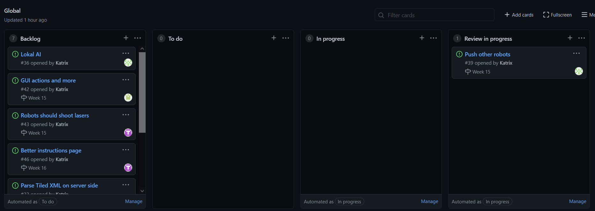
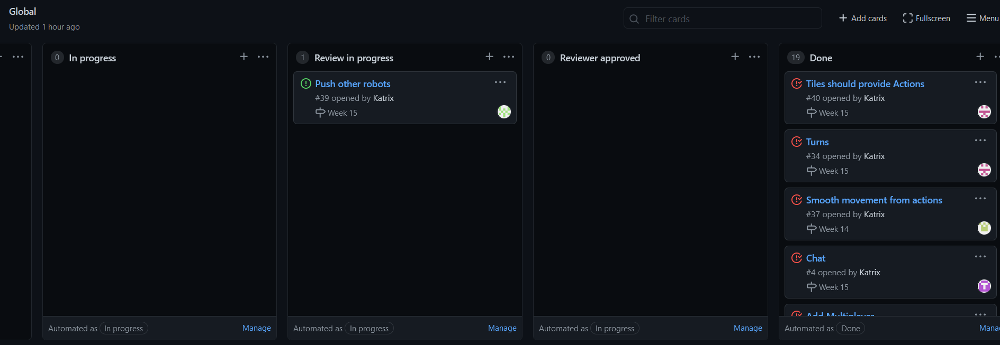
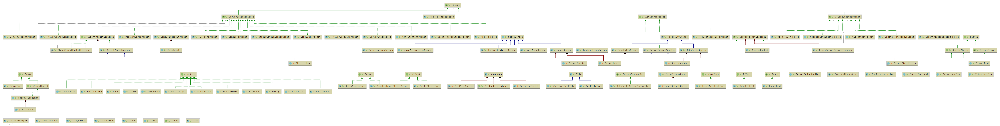
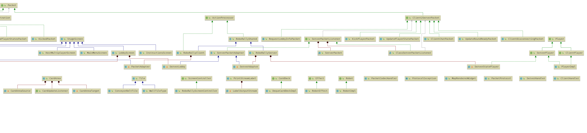

# Obligatorisk oppgave 4: Prosjekt RoboRally

## Deloppgave 1: Team og prosjekt

### Project Board:

23.04.21 12:19

### Roller:

Nå også fungerer rollene på samme måte, og vi har ikke gjort noen endringer her. Team-lead og kundekontakt er
uforandret, og hele teamet stiller som developers, og fyller inn der det trengs. Sånn som det ser ut nå er det ikke
nødvendig å gjøre endringer her, og rollefordeling er ikke noe som har skapt problemer for oss. Erfaringer og endringer:

* Det er viktig å passe på at merge conflicts of alle checks passer når man åpner en pull request
* Ferdige arbeidsoppgaver og tempo har vært veldig ubalansert, noen på teamet blir fort ferdig mens andre har brukt
  lengre tid. Dette fører til at det blir mye dødtid der teamet venter på at noe skal bli kodet/gjort ferdig av noen
  andre.
* Endringer vi har gjort her:
    * ny prosjektmetodikk, vi har laget fremdriftsplan for teamet, med ulike tasks som skal bli gjort hver uke, og en
      task har blitt gitt til en developer på teamet. Dette setter press på å få gjort ferdig oppgaver i tide, og legge
      inn mer effort for å få det gjort. Dette synes teamet er en god løsning, og kan føre til bedre resultat og mer
      effektiv jobbing.
* Når kommunikasjonen er god lever vi bedre produkt
* Lurt å lage ny branch for hver task
* Prosjektarbeid tar lang tid, det gjelder å jobbe i et kontinuerlig tempo, og få ting gjort til avtalte tider, sånn at
  resten av teamet ikke blir holdt igjen pga. noe noen andre skulle implementere, som ikke har blitt gjort.

Alle på teamet syns vi har gjort gode endringer, og at det som har blitt endret på var et bra valg. Vi har lært mye,
både om prosjektmetodikk men og om oss selv, og hvor mye kunnskap og tid vi har til å løse visse oppgaver. Poenget med
faget er å få prøvd seg fram og gjøre opp erfaringer på både godt og vondt om hvordan det er å jobbe i team, og bruke
verktøy man har til dette. Vi har alle nådd dette målet, og prøvd ut ulike metoder og fremgangsmåter for å løse
prosjektet på.

### Gruppedynamikken:

God sånn som sist. Dersom noen sitter fast hjelper resten av teamet, dersom noen trenger en “push” får de dette. Ros og
konstruktiv kritikk er på plass for å sørge for at god kode og gode resultat blir gitt. Vi får ikke møtt alle fysisk på
grunn av restriksjoner og at folk ikke er i byen, så grunnlaget for dynamikken blir for det meste lagt digitalt.

### Kommunikasjon:

Mye bedre enn når vi først startet. Vi ble enige om at dersom man sitter fast på noe, enten på grunn av tekniske problem
eller annet, skal vi kontakte teamet umiddelbart, så alle vet hva som foregår, hvor vi ligger ann og hva som må bli
prioritert. Dette har ført til bedre kommunikasjon over Discord. Vi tar og i bruk møtene vi har satt opp på mandagene
til diskutering og kodehjelp. Discord blir nå aktivt brukt til fildeling, hjelp og kommunikasjon.

### Forbederedningspunkter fra retroperspektiv:

Teamet føler prosjektet har gått bra, med tanke på hvor lite erfaring mesteparten av teamet har med prosjekt som dette
før. Vi har fått til en del, og er fornøyde med resultatene. De viktigste med dette faget er ikke å få ferdig
prosjektet, og vise fram det fineste spillet, men å jobbe i team og gjøre opp erfaringer fra dette, lære metodikk og
fremgangsmåter som får oss til og jobbe effektivt sammen, sånn at vi er bedre rustet til dette senere i livet når vi
faktisk sitter i en “skarp” situasjon jobbmessig og skal jobbe i teams. Dette har vi absolutt oppnådd, og prosjektet har
lært oss masse.

#### Hva vi har gjort bra:

* Har jobbet med tempo som har passet alle på teamet
* Har gjort gode endringer underveis på hvordan vi vil gjøre ting
* Alle stemmer blir hørt, og møter har vært demokratiske
* Vi har lagt til flere funksjoner vi mener ikke mange andre teams har, og fokusert på å gjøre disse gode, i stede for å
  pushe ut masse halveis kode
* Teamet har fått mye hjelp fra teamlead, og teamlead har levert priority support for å hjelpe resten, og
  pairprogramming med teamlead har var kunnskapsrikt
* Teamet var raske med å få all adminastrative ting på plass i starten, dette gikk fint
* Satt opp flere møter og pushet teamet til å bruke discord flittig

#### Hva vi ville endret på:

* Pushet teamet til å jobbe mer effektivt og prioritere prosjektet
* Mer kontinuerlig jobbing, mindre skippertak
* Kommunikasjon på topp med engang, spesielt dersom man sitter fast/har problem
* Oppdatere gruppen mer hva som foregår

## Deloppgave 2: Krav

Siden den forrige innleveringen har vi jobbet med:

*   Få multiplayer til å virke over nettverk
*   Smooth movement for spillet
*   Vegger
*   Laser
*   Chat funskjon
*   Runder i spillet

### Brukerhistorier og akseptansekrav til arbeidsoppgaver

#### Multiplayer

#### Brukerhistorier:
1. Som spiller ønsker jeg å ha med andre spillere, slik at spillet blir mer dynamisk, og det skjer mer endringer på
   brettet

##### Akseptansekrav:

1. Gitt at jeg har startet spillet
    1. Ønsker jeg å kunne bli med i et multiplayer spill noen andre hoster
    2. Ønsker jeg å kunne hoste et multiplayer spill

2. Gitt at jeg er med i et multiplayer spill
    1. Ønsker jeg å se flere spillere på brettet enn meg, og deres posisjon
    2. Ønsker jeg at hver spiller kan utføre handlinger
    3. Ønsker jeg å se handlinger utført av andre
    4. Ønsker jeg å kunne påvirke andre spillere

#### Arbeidsoppgaver    
Må lage server og client arkitektur for å kunne komusnisere over nettverk. 
Lage multiplayer slik at det kan være flere spillere med i et spill. 

    
### Lasere

#### Brukerhistorer:
1. Som laser ønsker jeg å vises på brettet og skal kunne skytte på roboten, slik at den git damage til roboten
   går den blir truffet av laseren.

#### Akseptansekrav:
1. Gitt at der en laser på brettet
    1. skal den vises på brettet
    2. skal den kunne plaseres over flere ruter på brettet
    3. skal laseren gi damage til roboten hvis den blir truffet av laseren

#### Arbeidsoppgaver
Trenger funksjon til å sammenligne posisjonen til laseren med spiller slik at vi kan gi damage til spilleren som står i
en slik posisjon. Vi må gå gjennom brettet og finne ut hvor laserene befinner seg.

### Vegger

#### Brukerhistorer:

1. Som vegg ønsker jeg å hindre at roboter ikke kan gå gjennom meg eller stå oppå meg, slik at det ikke er mulig å gå alle plasser på
   brettet.
   
#### Akseptansekriterier:

1. Gitt at det er vegger på brettet
    1. skal disse vises på brettet slik at spilleren ser hvor det ikke er mulig å gå.
    2. Trenger en metode for å sjekke om det er en vegg i alle retninger fra posisjonen til roboten.
    3. Skal den stoppe lasere slik at roboter ikke tar skade.

#### Arbeidsoppgaver
1. Må kunne legge til vegger på brettet slik at spilleren kan se dem, veggene skal ligge mellom rutene på brettet
2. Må sørge for at roboten ikke kan flytte seg gjennom eller på veggene.

### Push robots

#### Brukerhistroer:
1. Som spiller ønsker jeg at roboten min kan dytte andre roboter på brettet, slik at jeg har mulighet å komme meg til flaget først.
2.  Som brett ønsker at robotene ikke da dytte andre roboter hvis det er vegg som hindre å flytte robotene

#### Akseptansekriterier
1. Gitt at spilleren har en robot på brettet og det er en robot som står i den retningen den ønsker å gå
    1. skal roboten kunne dytte roboten
    2. hvis det er vegg i veien skal roboten ikke kunne dytte en annen robot

#### Arbeidsoppgaver:
Robotene skal kunne dytte roboter som er i veien for der de skal gå. Hvis det er vegg som står i veien skal i robotene
flytte på seg.

### Chat

#### Brukerhistorier:
1. Som spiller ønsker jeg å kunne snakke med de jeg spiller sammen med slik at
    1. vi kan kommunsiere mens vi spiller
    2. det skal bli mer sosialt å spille når vi spiller over nettverk

#### Akseptansekriterier
1.  Gitt at det er flere spillere som spiller over nettverk skal spillerne kunne
    1. skrive meldinger til de andre spillerene
    2. se tidligere meldinger som er sendt

#### Arebidsoppgaver
Det er nødvendig å lage en felt der vi kan skive meldinger vi ønsker å sende til de andre spillerene. Det må være en boks der vi kan
se de meldingene som er blitt sendt i chaten. Det må være mulig å skjule chaten slik at vi kan se hele spillebrettet.

### Exit button

#### Brukerhistorier:
1.  Som spill ønsker jeg at der er en exit button som spilleren kan trykke på slik at spillet samles og lukkes på en god måte.

#### Akseptansekriterier
1. Gitt at du har startet ett spill skal du
    1. kunne avslutee spillet når du trykker på exit kanppen
    2. se exit knappen for avsluutee spillet må vises på skjermen slik at spilleren kan se og trykke på den

#### Arbeidsoppgaver
Må lage en knapp i GUI som spilleren kan trykke på slik at spillet avslutter på en sikker måte.

### Rounds

#### Brukerhistorier:
1. Som spillere ønsker at vi kan velge hvilke trekk vi vil gjøre slik at robotene flytter seg rundt på brettet.
2. Som spill ønsker vi at spillerne skal få delt ut kort og kan programmere robotene sine slik at robotene kan bevege seg.

#### Akseptansekriterier
1. Spiller
    1. Må få  utdelt kort og kunne programere roboten
2. Spillet
    1. Må kunne la spillerne programmere robotene sine og gjennomføre trekkene
    2. Må dele ut kort til spillerne slik at velge hvilke trekk de vil gjøre
    3. Roboten må flytte seg slik spilleren har programert og etter riktig tur.

#### Arbeidsoppgaver
Vi må implemetere server oppførsel og at tiles på brettet har riktig oppførsel. Spillere må utdelt kort hver runde slik at de
kan programere robotene sine. Robotene må flytte seg rundt på brettet etter riktig tur og slik spilleren har programert.

### Smooth movement

####  Brukerhistorier:
1. Som spill ønsker jeg at robotene bevger mer flytende på bretter slik at vi får en finere grafisk presentasjon av bevegelsene
   på brettet.

#### Akseptansekrav:
1. Spill
    1. Må kunne gjøre slik at spilleren ikke har en for brå overgang fra
       tile til tile.
    2. Må ikke påvirke andre spillerfunksjoner og moves, men se bra ut når
       spilleren er i bevegelse.
    3. Må ha en størrelse som gjør at det ser mest mulig “pent” ut i forhold
       til brettet.

#### Arbeidsoppgaver
Må sørge for roboten beveger mer flytende på brettet. For å få til dette må vi gjemme roboten på brettet og
viser et sprite som har spillerstukrur istendefor. Dette spritet kan flytte og rotere seg friere enn roboten
på brettet.

MVP kravene vi har dekket:

1. Vise et spillebrett
2. Vise brikke på spillebrett
3. Flytte brikke (vha taster e.l. for testing)
4. Robot besøker flagg
5. Robot vinner ved å besøke flagg
6. Dele ut kort
7. Velge 5 kort
8. Bevege robot ut fra valgte kort
9. Spille fra flere maskiner

Mye av det vi har implementert så langt har ikke en grafisk representasjon, men 
fungerer i testene. Hadde vi fått laget kode for å representere det grafisk og 
laget flere maps som har disse elementene. Satser vi på at det hadde virket grafisk siden 
det virker i testene vi har skrevet. 

### Known bugs
* (Only seen once) On multiplayer, a player can be initialized wrongly, and thus be missing from the board.
* Multiplayer can be crashy
* Probably a bunch of race conditions if the ping between players is high enough
* Rotating conveyor belts are broken in all but the most simple cases (player facing the same way as conveyor belt goes)
* Robot pushing er buggy i lokal multiplayer.
* Robot pushing virker ikke med WASD. Dette er et mer fundamentalt problem med hvordan netverksprotokolen vår virker.
  Ettersom at dette er en debug funksjon, er ikke denne buggen altfor høyt opp på prioritetslisten.
* Kick player field is moving robot when you are typing WASD

## Deloppgave 3: Produktleveranse og Kodekvalitet

### Class diagram

### Bidrag til Kodebasen

Det er forskjellig arbeidsmengde til hver person i gruppen. Dette er rett og slett fordi noen av oss har mer erfaring
enn andre. Vi har da prøvd å fordele oppgaver slik at det blir like utfordrende for hvert medlem. Dersom det er like
utfordrende for hvert medlem vil arbeidsmengden bli skjevfordelt i og med at vi har forskjellig kunnskapsnivå på
gruppen! Noen commits er også større og mer krevende enn andre som gjer at visse oppgaver tar lengre tid å få på plass
før vi kan committe. Vi prøver alltid å ha en fullstendig kode før vi committer og lager PR, derfor tar noen oppgaver
lenger tid, og det er færre committs.

### Prosjektpresentasjon

Vi skal vise demo av spillet! Det er viktig for oss å få frem det vi har lært av å jobbe sammen på dette prosjektet. Vi
har blant annet funnet ut hvordan det er å jobbe sammen på tross av kunnskapsnivå og erfaring, og hatt en god måte å
forstå hverandre på til tross for dette. Det vi har slitt mest med gjennom prosjektet er kommunikasjon og tempo. Dette
er noe vi har prøvd å jobbe på gjennom hver uke og vi legger alltid vekt på hvor viktig dette er på møtene våre! Vår
gruppe forstår godt hvor mye bedre gruppearbeidet hadde vært dersom det var fysisk tilstedeværelse. Den siste uken med
arbeid var vi alle til stede i Bergen og kunne sitte sammen på skolen for å arbeide. Vi så da at vi hadde mye bedre
kommunikasjon, høyere tempo og forståelse for hverandre sin arbeidsmengde.

### Multiplayer PR

En av de store PRene som vi har fått inn i denne leveringen er multiplayer PRen. Når vi ser tilbake var denne altfor
stor, og kunne enkelt ha selv vært 5 eller flere PRer som implementerte litt av den ønskede funksjonene hver. Det er
mange grunnen til at vi ikke gjorde det slik. En tidlig grunn var at det ville være død kode som ikke ble brukt, og vi
ville ikke få trekk for mye død kode. Det andre store grunnen er nokk bare at det lett ble en veldig stor snøball som
var vanskelig å stoppe uten at alle andre PRer fikk store merge konflikter. Derfor valgte vi å vente med å merge
multiplayer PRen til det ikke var mange andre PRer som ville ha blitt påvirket.

