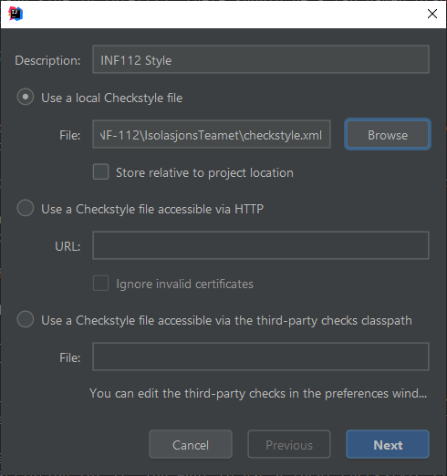

# INF112 Isolasjonsteamet Roborally 
A RoboRally implementation using libGDX.

## Running the project
1. **Required programs**
   
   You need git and Java 11 or later installed on your system to build, run and
   test the game. Java 8 can work as long as you don't try packaging the game.

2. **Cloning the project**

   Open your terminal and run `git clone https://github.com/inf112-v21/IsolasjonsTeamet.git`.
   This should create a new folder called `IsolasjonsTeamet`. Move into it with
   `cd IsolasjonsTeamet`.
   
3. **Running the game, and running tests**
   
   Now you need to invoke the `gradlew` script however you invoke scripts in 
   your shell. If you're using Window's `cmd`, then it's `gradlew <command>`. 
   If you use anything else, it's `./gradlew <command>`. For the rest of this 
   section I'll assume you're not using `cmd`.
   
   To run the tests, run `./gradlew test`. To run the actual game, 
   run `./gradlew run`. No need to worry about having the right JDK version 
   on your system. Gradle will take care of it.

4. **Packaging the game**
   
   Reminder that you need Java 11 or higher for this part.

   To package the game, run `./gradlew jpackage`. An application distributable
   appropriate for your system will be generated in `\build\jpackage\isolasjonsteamet-roborally`.
   For example, if you're on Windows, this will be an `.exe` program, which you
   can start like any other EXE.
   
   Known bug in distribution: On windows, the console is never visible. 
   If you need to see the console, run `./gradlew image`. An application can 
   then be started using `./build/image/scripts/isolasjonsteamet-roborally`

## Project setup for development

1. **Clone the project**
2. **Importing the project**

   Open the project in IntelliJ. IntelliJ will load the dependencies and other 
   info from the build script. Whenever the build script changes, you will have 
   to reload the build script.
   
   **To reload the build script**
   On the right hand side in IntelliJ, there should be a tab named Gradle. 
   Open this, and find the refresh button. It should be two arrows in a circle.
   
   

3. **Using JDK 15 or above**

   This project requires Java 15 or above. While Gradle handles this automatically, 
   IntelliJ sadly doesn't.
   
   First, open to project structure window using `Ctrl+Alt+Shift+S`. 
   Select the `Project` tab under `Project Settings`. Under `Project SDK`, 
   if it says 15 or above, you're set. Otherwise we need to set the JDK to use.
   Click on the drop down, and select `Add JDK`. If you have Java 15 or above 
   already installed on your system, you can select the `JDK` option here and 
   navigate to it. Otherwise, select `Download JDK`, and choose an JDK to use. 
   AdoptOpenJDK is fine for most stuff. IntelliJ will download and add it 
   as an option for you.
   
   

4. **Setting the formatting style**

   Import and set the formatting style. Go to File -> Settings -> Editor -> Code style. 
   Click on the cog and select Import Scheme -> IntelliJ IDEA code style XML. 
   The file to import is `extra/intellij-java-google-style-adapted.xml`.
   
   .
   
   Give the scheme a nice and descriptive name, and select it from the scheme dropdown, 
   next to the cog.

   You can now format the code with `Ctrl+Alt+L`.

5. **Setting up IntelliJ with Checkstyle**

   Install the IntelliJ plugin "CheckStyle-IDEA". It's mostly the same as installing 
   the "Code with me" plugin.
   
   Next go File -> Settings -> Tools -> CheckStyle. You need to add our checkstyle config here. 
   Click on the small plus button at the bottom of the "Configuration Files" table. 
   
   A small dialog box should pop up asking for where to find the file, 
   and a nice description for it. You want to use a local Checkstyle file. 
   Browse to `checkstyle.xml` found in the root of this repo.
   
   

   Then just follow the wizard, and click next and finish a few times.
   It should now be in the table you saw earlier, click on the checkbox to make sure it's active.
   Your code should now show yellow if there are any style issues.

6. **Setting up the precommit script**

   Sometimes you forget to check the formatting before you commit. 
   To prevent this, you can setup a precommit script that is always run before you commit.
   If the script fails, it won't let you commit. I've prepared such a script already that 
   does just this in `extra/pre-commit`. Just copy this file into `.git/hooks/` and you're done.

## Gradle primer
Gradle is a build tool just like Maven, but it also differs in many areas.
The two most obvious are the commands you use to do something, and the syntax
you use in the build file.

### The syntax
Gradle build scripts are programs written in Groovy (or more recently Kotlin).
You can think of Groovy as a dynamically typed Java with some other changes here and there. 
You can define functions and variables, pass them around, and all that. 
For the most part for our usecase, we hopefully won't need to use this 
programmatic aspect of Gradle too much at the start. Instead, we'll save it 
for if we need to do anything complex.

### The commands

To invoke Gradle, you use `gradlew`. If you're in the old windows command prompt, 
you use it like so `gradlew <command>`. Otherwise you use it like so `./gradlew <command>`. 

#### Compile
To compile the project, use `compileJava`. You can also use `compileTestJava` to compile the tests.

### Run
To run the project, use `run`.

### Tests
To run the tests, use `test`.

### Build
To a build a distributable, use `build`. A distribution will be generated in 
`build/distributions` which contains everything needed to run the game.

### Run CheckStyle
To run CheckStyle, use `checkstyleMain`.

## Known bugs
* (Only seen once) On multiplayer, a player can be initialized wrongly, and thus be missing from the board.
* Multiplayer can be crashy
* Probably a bunch of race conditions if the ping between players is high enough
* Game crashes if closing the window directly
* Game sometimes throws an exception when exiting local multiplayer
* Rotating conveyor belts are broken in all but the most simple cases (player facing the same way as conveyor belt goes)
